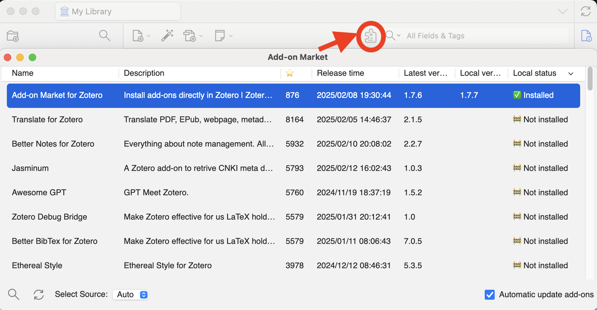

#  Zotero 插件市场

  

[English](../README.md) | [简体中文](README-CN.md)

## 简介

这是一个用于在 [Zotero](https://www.zotero.org) 内浏览和安装插件的 [Zotero](https://www.zotero.org) 插件

## 安装

1. 下载[最新版xpi安装包](https://github.com/syt2/zotero-addons/releases/latest/download/zotero-addons.xpi)

2. 在 Zotero 内安装 `(工具) -> (附加组件)`

## 使用方法

安装完成后，点击工具栏的  按钮，或者在`工具`菜单内点击`插件市场`

## 插件数据源

对于国内用户，若遇到插件页面空白、加载不出插件的情况，请尝试切换不同的数据源  
插件提供**自动源**选项，将会自动选择可连接的源

### [zotero-chinese/zotero-plugins](https://github.com/zotero-chinese/zotero-plugins)

插件主数据源来自Zotero中文社区 **[zotero-chinese/zotero-plugins](https://github.com/zotero-chinese/zotero-plugins)**.

在插件市场界面选择 `(zotero中文社区)` 即可使用该数据源

> 若你有新的插件想要添加到插件源内，请提交至 [zotero-chinese/zotero-plugins](https://github.com/zotero-chinese/zotero-plugins).

### [syt2/zotero-addons-scraper](https://github.com/syt2/zotero-addons-scraper)

在插件市场界面选择 `(插件爬虫)` 即可使用该数据源

### 自定义源

任何符合 [zotero-chinese/zotero-plugins](https://github.com/zotero-chinese/zotero-plugins) 格式的数据源都可用作本插件的数据源，你可以在插件内选择`自定义源`并提供数据源URL即可

## Star 历史

<a href="https://star-history.com/#syt2/zotero-addons&Timeline">
  <picture>
    <source media="(prefers-color-scheme: dark)" srcset="https://api.star-history.com/svg?repos=syt2/zotero-addons&type=Timeline&theme=dark" />
    <source media="(prefers-color-scheme: light)" srcset="https://api.star-history.com/svg?repos=syt2/zotero-addons&type=Timeline" />
    
  </picture>
</a>
